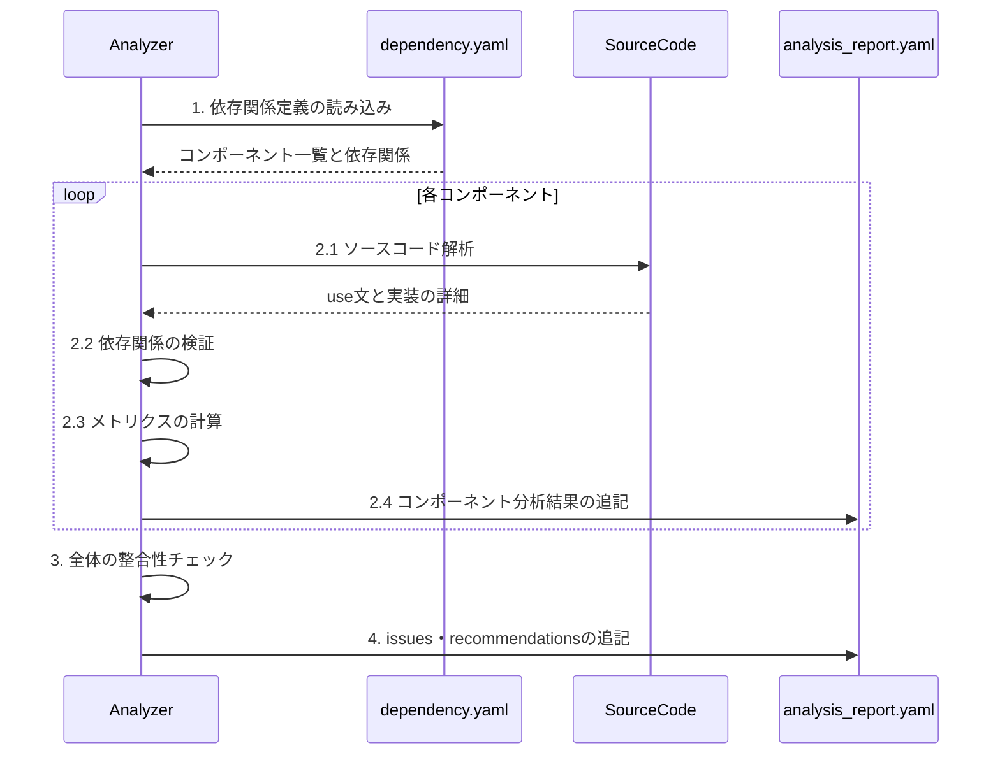

# 依存性分析ワークフロー

## 重要な注意事項
1. 必ずシーケンス図に示された順序で処理を実行すること
2. フェーズ1-3の結果はチャット上でmarkdown形式で報告し、最終レポート（フェーズ4）のみyamlファイルとして出力すること
3. 指定されていない追加のフィールドや情報は出力しないこと

## 目的
dependency.yamlとソースコードを分析し、analysis_report.yamlを生成する。

## 入力
- dependency.yaml（必須）
- プロジェクトのソースコード

## 出力
- analysis_report.yaml（逐次更新）

## 処理シーケンス



## 分析手順

### 1. dependency.yamlの解析
```markdown
## 依存関係分析レポート
対象ファイル: dependency.yaml
分析結果:
  - コンポーネント一覧:
    - [コンポーネント名1]
    - [コンポーネント名2]
  
  - 依存関係:
    - [コンポーネント名1]:
      - 直接依存: [依存先リスト]
      - 間接依存: [依存先リスト]
    
  - 役割定義:
    - [コンポーネント名1]: [役割の説明]
    - [コンポーネント名2]: [役割の説明]
```

### 2. ソースコード検証
各コンポーネントのソースコード分析後、以下の形式で報告：

```markdown
## コンポーネント分析レポート
対象コンポーネント: [ファイルパス]

### メトリクス情報
- 結合度スコア: [0.0-1.0]
- 結合度レベル: [LOW/MEDIUM/HIGH]
- 直接依存数: [数値]
- 間接依存数: [数値]
- 循環参照: [あり/なし]

### 特性分析
- グローバル状態の使用: [あり/なし]
- シングルトンパターン: [あり/なし]
- 静的メソッド: [あり/なし]
- 外部サービス利用: [あり/なし]
- パラメータ複雑度: [LOW/MEDIUM/HIGH]

### レイヤー情報
- タイプ: [CONTROLLER/SERVICE/MODEL等]
```

### 3. メトリクス計算
各コンポーネントの分析完了後、以下の形式で報告：

```markdown
## メトリクス分析レポート
対象コンポーネント: [ファイルパス]

### メトリクス情報
#### 結合度
- スコア: [0.0-1.0]
- レベル: [LOW/MEDIUM/HIGH]
- 直接依存数: [数値]
- 間接依存数: [数値]
- 循環参照: [true/false]

#### 凝集度
- スコア: [0.0-1.0]
- 責務の集中度: [0.0-1.0]

### 特性
- グローバル状態の使用: [true/false]
- シングルトンパターン: [true/false]
- 静的メソッド: [true/false]
- 外部サービス利用: [true/false]
- パラメータ複雑度: [LOW/MEDIUM/HIGH]

### 依存関係
- 直接依存: [依存コンポーネント名のリスト]
- 間接依存: [依存コンポーネント名のリスト]
```

### 循環参照分析
- 検出された循環参照:
  - 関連コンポーネント: [コンポーネント名のリスト]
  - 深刻度: [LOW/MEDIUM/HIGH]
  - 検出パス: [依存関係のパス]

### 4. レポート生成

```yaml
# analysis_report.yaml として出力
dependency_analysis_report:
  components:
    - component_id: ファイルパス
      metrics:
        coupling:
          score: 0.0-1.0
          level: LOW/MEDIUM/HIGH
          direct_dependencies: 数値
          indirect_dependencies: 数値
          circular_dependencies: true/false
        cohesion:
          score: 0.0-1.0
          responsibility_focus: 0.0-1.0
      characteristics:
        global_state: true/false
        singleton_usage: true/false
        static_methods: true/false
        external_services: true/false
        parameter_complexity: LOW/MEDIUM/HIGH
      layer_info:
        type: コンポーネント種別
        role: 役割の説明
      dependencies:
        direct: [依存コンポーネント名]
        indirect: [間接依存コンポーネント名]
  
  issues:
    circular_dependencies:
      - components: [循環参照コンポーネント名]
        severity: LOW/MEDIUM/HIGH
```

## 注意事項

1. dependency.yamlとの整合性を重視
2. メトリクスは実装の実態に基づいて計算
3. 違反検出は具体的な箇所を示す
4. フェーズ1-3の結果はチャット上で報告
5. 最終レポート（フェーズ4）のみanalysis_report.yamlとして出力
6. 処理はシーケンス図の順序通りに実行

## 完了条件
1. dependency.yamlの全エントリが検証されていること
2. メトリクスが完全に計算されていること
3. 各フェーズの分析結果が指定された形式で報告されていること
4. 最終レポートが指定された形式でファイル出力されていること