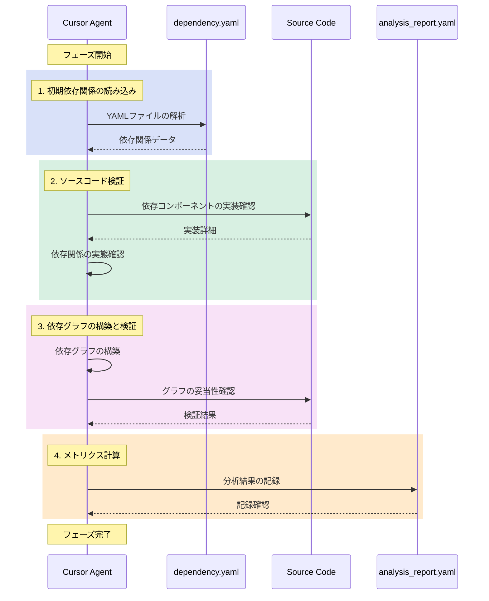

# 依存性分析ワークフロー

## 概要
dependency.yamlに記録された依存関係と実装コードを分析し、DIパターン適用のための詳細な分析レポートを生成するワークフローです。

## メタデータ
```yaml
version: 1.0.0
last_updated: 2024-03-21
author: Cursor Agent
status: draft
```

## 1. 依存関係の静的解析フェーズ

### フェーズの流れ


### 入力
- dependency.yaml（依存関係定義）
- プロジェクトのソースコード

### 1. 初期依存関係の読み込み
1. dependency.yamlの解析
   ```yaml
   analysis_steps:
     - load_yaml_file:
         path: "dependency.yaml"
         validation:
           - check_file_exists
           - validate_yaml_syntax
     
     - construct_dependency_graph:
         node_types:
           - CONTROLLER
           - SERVICE
           - MODEL
           - POLICY
         edge_types:
           - DIRECT
           - INDIRECT
           - CIRCULAR
   ```

2. 依存グラフの構築
   ```yaml
   graph_construction:
     nodes:
       - extract_components
       - assign_component_types
     edges:
       - map_direct_dependencies
       - calculate_indirect_dependencies
       - detect_circular_dependencies
   ```

### 2. ソースコード検証
```yaml
source_code_verification:
  steps:
    - for_each_dependency:
        action: "依存先コンポーネントの実装コードを確認"
        verify:
          - import_statements: "use文の確認"
          - actual_usage: "実際の使用箇所の特定"
          - dependency_type: "依存の種類の判別"
            types:
              - "クラス継承"
              - "インターフェース実装"
              - "メソッド呼び出し"
              - "プロパティ参照"

    - validate_dependencies:
        action: "dependency.yamlとの整合性確認"
        checks:
          - missing_dependencies: "YAMLに記載されていない依存の検出"
          - unused_dependencies: "記載されているが未使用の依存の検出"
          - implicit_dependencies: "間接的な依存関係の検出"

    - dependency_context:
        action: "依存関係の文脈を理解"
        analyze:
          - scope: "依存の影響範囲"
          - lifecycle: "オブジェクトのライフサイクル"
          - coupling_type: "結合度の種類"
```

### 3. 依存グラフの構築と検証
```yaml
graph_construction_and_validation:
  steps:
    - build_initial_graph:
        source: "dependency.yaml"
        
    - verify_with_source:
        action: "ソースコードとの整合性確認"
        checks:
          - actual_dependencies: "実装上の依存関係"
          - dependency_direction: "依存の方向性"
          - dependency_strength: "依存の強さ"
        
    - update_graph:
        action: "検証結果に基づくグラフの更新"
        updates:
          - add_missing_edges: "未記載の依存を追加"
          - update_edge_weights: "依存の強さを反映"
          - mark_implicit_deps: "暗黙の依存を記録"
```

### 成果物
```yaml
dependency_analysis_report:
  component_id: "app/Http/Controllers/TodoController.php"
  metrics:
    coupling:
      score: 0.85
      level: "HIGH"
      direct_dependencies: 4
      indirect_dependencies: 7
      circular_dependencies: true
    cohesion:
      score: 0.6
      responsibility_focus: 0.7
  
  characteristics:
    global_state: false
    singleton_usage: false
    static_methods: true
    external_services: true
    parameter_complexity: "MEDIUM"
  
  layer_info:
    type: "CONTROLLER"
    violations:
      - "直接的なリポジトリアクセス"
```

## 2. パターン評価への移行

### 2.1 分析結果の受け渡し
```yaml
handover:
  workflow: "WORKFLOW_DI_EVALUATE.md"
  input_data:
    source: "dependency_analysis_report"
    format: "analysis_input"  # WORKFLOW_DI_EVALUATEの入力形式に合わせる
```

### 2.2 移行の判断基準
- 依存関係の分析が完了していること
- メトリクスが正しく計算されていること
- 特性分析が完了していること
- レイヤー情報が特定されていること

## 完了条件
1. 依存関係の分析レポートが生成されていること
2. WORKFLOW_DI_EVALUATEへの入力データが準備されていること
3. すべての重要な依存関係が分析されていること

## エラー処理
1. 入力ファイルの問題
   ```yaml
   error_handling:
     file_not_found:
       action: "エラーを報告し、処理を中断"
       message: "依存関係ファイルが見つかりません: {file_path}"
     
     invalid_yaml:
       action: "構文エラーの箇所を特定して報告"
       message: "YAMLの構文エラー: {error_details}"
   ```

2. 分析エラー
   ```yaml
   analysis_errors:
     circular_dependency:
       action: "警告を記録し、分析を継続"
       severity: "WARNING"
     
     invalid_pattern:
       action: "エラーを記録し、代替パターンを探索"
       severity: "ERROR"
   ```

## 注意事項
- 依存関係の分析は必ず依存性グラフの構築から開始すること
- コード構造の分析は実装の詳細に踏み込んで行うこと
- パターン推奨は具体的な根拠とともに提示すること
- セキュリティとパフォーマンスの考慮を含めること