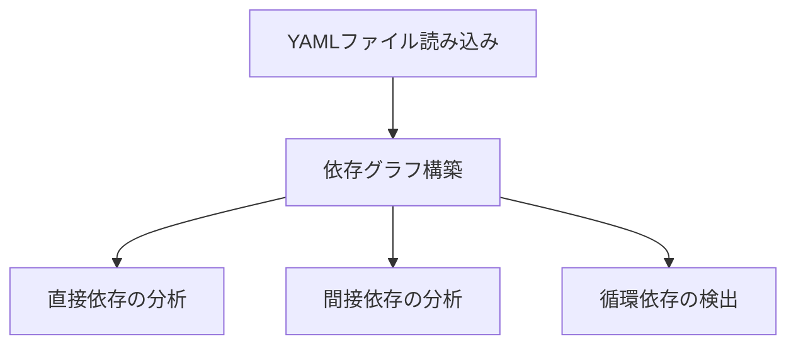

# 依存性分析ワークフロー

## 1. YAMLファイル解析フェーズ

### 1.1 依存関係グラフの構築


### 1.2 解析出力形式
```yaml
dependency_graph:
  nodes:
    - id: "app/Http/Controllers/TodoController.php"
      type: "CONTROLLER"
      dependencies:
        direct:
          - "app/Services/TodoService.php"
          - "app/Models/Todo.php"
        indirect:
          - "app/Models/User.php"
        circular:
          - "app/Models/Tag.php"
```

## 2. メトリクス計算フェーズ

### 2.1 結合度の計算
```yaml
coupling_metrics:
  calculation_rules:
    direct_dependency_weight: 1.0
    indirect_dependency_weight: 0.5
    circular_dependency_weight: 2.0
    
  thresholds:
    high: 0.7
    medium: 0.4
    low: 0.0
```

### 2.2 凝集度の評価
```yaml
cohesion_metrics:
  evaluation_points:
    - responsibility_focus
    - internal_dependencies
    - layer_appropriate_dependencies
  
  scoring:
    responsibility_focus:
      single_responsibility: 1.0
      mixed_responsibilities: 0.5
    internal_dependencies:
      well_encapsulated: 1.0
      leaked_implementation: 0.5
```

## 3. 特性分析フェーズ

### 3.1 コード特性の検出
```yaml
code_characteristics:
  patterns:
    global_state:
      - pattern: "use.*Facade"
      - pattern: "static::"
    singleton:
      - pattern: "getInstance()"
    static_methods:
      - pattern: "static function"
    external_services:
      - pattern: "inject.*Service"
```

### 3.2 レイヤー分析
```yaml
layer_analysis:
  rules:
    controller:
      allowed_dependencies:
        - "Services"
        - "Models"
        - "Policies"
      forbidden_dependencies:
        - "Controllers"
        - "Repositories"
    service:
      allowed_dependencies:
        - "Models"
        - "Repositories"
```

## 4. 出力生成フェーズ

### 4.1 分析結果の統合
```yaml
analysis_result:
  component_analysis:
    app/Http/Controllers/TodoController.php:
      metrics:
        coupling:
          score: 0.85
          level: "HIGH"
          direct_dependencies: 4
          indirect_dependencies: 7
          circular_dependencies: true
        cohesion:
          score: 0.6
          responsibility_focus: 0.7
      
      characteristics:
        global_state: false
        singleton_usage: false
        static_methods: true
        external_services: true
        parameter_complexity: "MEDIUM"
      
      layer_info:
        type: "CONTROLLER"
        violations:
          - "直接的なリポジトリアクセス"
```

### 4.2 リファクタリング候補の提案
```yaml
refactoring_candidates:
  primary:
    pattern: "インターフェース抽出"
    reason: "外部サービスへの依存が多く、テスト容易性の向上が必要"
  secondary:
    - pattern: "静的メソッド公開"
      reason: "静的メソッドの依存があり、テスト性の改善が必要"
```

## 5. 検証フェーズ

### 5.1 分析結果の検証
- メトリクス計算の正確性確認
- 特性検出の精度確認
- レイヤー違反の確認

### 5.2 出力データの整合性チェック
```yaml
validation_rules:
  metrics:
    - coupling_score_range: [0.0, 1.0]
    - cohesion_score_range: [0.0, 1.0]
  characteristics:
    - required_fields: ["global_state", "static_methods"]
    - boolean_values: ["global_state", "singleton_usage"]
  layer_info:
    - valid_types: ["CONTROLLER", "SERVICE", "MODEL"]
```

## 6. 次フェーズへの連携

### 6.1 WORKFLOW_EVALUATE_DIへの入力準備
```yaml
evaluate_workflow_input:
  coupling_level: "HIGH"
  global_state: false
  implementation_complexity: "MEDIUM"
  test_requirements: "HIGH"
```

### 6.2 分析結果のドキュメント化
- メトリクス概要
- 検出された問題点
- 推奨される改善パターン
- レイヤー違反の詳細