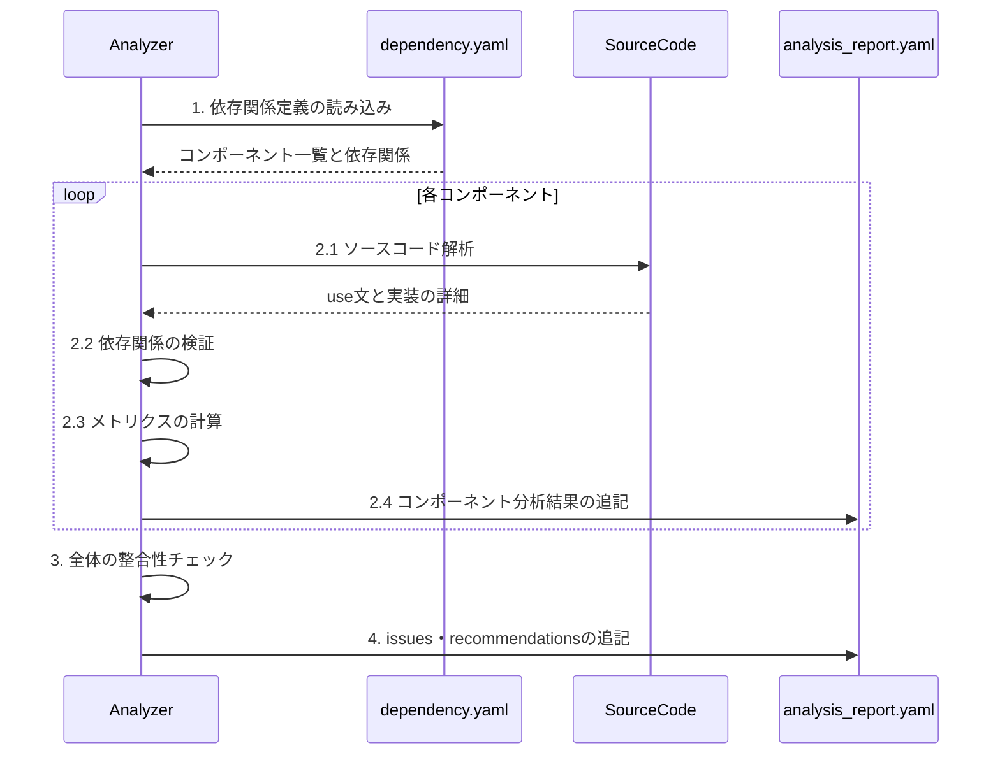

# 依存性分析ワークフロー

## 目的
dependency.yamlとソースコードを分析し、analysis_report.yamlを生成する。

## 入力
- dependency.yaml（必須）
- プロジェクトのソースコード

## 出力
- analysis_report.yaml（逐次更新）

## 処理シーケンス



## 分析手順

### 1. dependency.yamlの解析
```yaml
確認項目:
  - 定義されているコンポーネント一覧
  - 宣言されている依存関係
  - 各コンポーネントの役割定義
```

### 2. ソースコード検証
dependency.yamlの各エントリに対して：

```yaml
検証項目:
  - use文による依存関係の確認
  - 実装における依存の種類
    - メソッド呼び出し
    - プロパティ参照
    - 型定義での使用
  - 未宣言の依存関係の検出
```

### 3. メトリクス計算

```yaml
必須メトリクス:
  coupling:
    - score: 0.0-1.0
    - level: LOW/MEDIUM/HIGH
    - direct_dependencies: 数値
    - indirect_dependencies: 数値
    - circular_dependencies: true/false
  
  cohesion:
    - score: 0.0-1.0
    - responsibility_focus: 0.0-1.0

  characteristics:
    - global_state: true/false
    - singleton_usage: true/false
    - static_methods: true/false
    - external_services: true/false
    - parameter_complexity: LOW/MEDIUM/HIGH
```

### 4. レポート生成

```yaml
レポート構造:
  dependency_analysis_report:
    components:
      - component_id: ファイルパス
        metrics: メトリクス情報
        characteristics: 特性情報
        layer_info:
          type: コンポーネント種別
          violations: 違反リスト
    
    services:
      サービス名:
        dependencies: 依存関係
        features: 機能一覧
        metrics: メトリクス情報
    
    issues:
      - 検出された問題点
    
    recommendations:
      - 改善提案
```

## 注意事項

1. dependency.yamlとの整合性を重視
2. メトリクスは実装の実態に基づいて計算
3. 違反検出は具体的な箇所を示す
4. 改善提案は実装可能な内容とする
5. 各分析完了後、即座にレポートに追記する

## 完了条件
1. dependency.yamlの全エントリが検証されていること
2. メトリクスが完全に計算されていること
3. 各コンポーネントの分析結果がレポートに反映されていること
4. 全体の問題点と改善提案が追記されていること