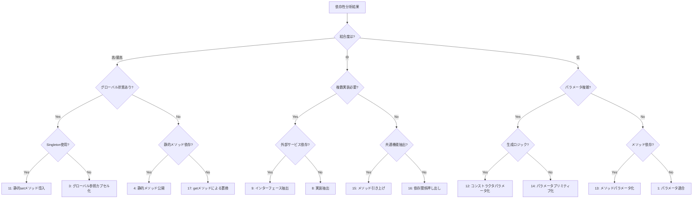
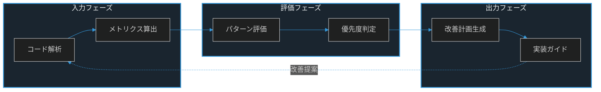

# 依存性注入パターン決定木

## 1. 入力データ形式

### 1.1 分析結果の受け取り
```yaml
analysis_input:
  component_id: "app/Http/Controllers/TodoController.php"
  metrics:
    coupling:
      score: 0.85        # 0-1のスコア
      level: "HIGH"      # HIGH, MEDIUM, LOW
      direct_dependencies: 4
      indirect_dependencies: 7
      circular_dependencies: true
    cohesion:
      score: 0.6
      responsibility_focus: 0.7
  
  characteristics:
    global_state: false
    singleton_usage: false
    static_methods: true
    external_services: true
    parameter_complexity: "MEDIUM"
  
  layer_info:
    type: "CONTROLLER"
    violations:
      - "直接的なリポジトリアクセス"
```

### 1.2 評価結果の出力
```yaml
pattern_evaluation_output:
  component_id: "app/Http/Controllers/TodoController.php"
  
  evaluation_criteria:
    coupling_level: "HIGH"
    characteristics:
      - global_state: false
      - singleton_usage: false
      - static_methods: true
      - external_services: true
    layer_type: "CONTROLLER"
  
  selected_patterns:
    primary:
      pattern_id: 9
      name: "インターフェース抽出"
      reason: "外部サービスへの依存が多く、テスト容易性の向上が必要"
      constraints:
        - "インターフェース定義が必要"
        - "モックオブジェクトの準備が必要"
    
    secondary:
      - pattern_id: 4
        name: "静的メソッド公開"
        reason: "静的メソッドの依存があり、テスト性の改善が必要"
        constraints:
          - "インスタンスメソッドへの変換が必要"
      
      - pattern_id: 13
        name: "メソッドパラメータ化"
        reason: "パラメータの複雑性が中程度"
        constraints:
          - "メソッドシグネチャの変更が必要"

  pattern_constraints:
    dependencies:
      - dependent: 13
        requires: [9]
        reason: "インターフェース定義後にパラメータ化を適用"
    
    conflicts:
      - patterns: [11, 3]
        reason: "同時適用による矛盾の発生"

  layer_constraints:
    type: "CONTROLLER"
    required_patterns: [9, 12]
    avoid_patterns: [15]
    reason: "コントローラーレイヤーの責務に基づく制約"
```

## 2. 決定木の構造



## 3. パターン選択ロジック

### 3.1 メトリクスベースの判定
```python
def evaluate_metrics(metrics):
    if metrics.coupling.score >= 0.7:
        return "HIGH"
    elif metrics.coupling.score >= 0.4:
        return "MEDIUM"
    else:
        return "LOW"
```

### 3.2 特性ベースの判定
```python
def evaluate_characteristics(chars):
    if chars.global_state or chars.singleton_usage:
        return "GLOBAL_STATE"
    elif chars.static_methods:
        return "STATIC_METHODS"
    elif chars.external_services:
        return "EXTERNAL_SERVICES"
    else:
        return "STANDARD"
```

### 3.3 レイヤー固有の判定
```yaml
layer_specific_rules:
  CONTROLLER:
    high_priority_patterns:
      - pattern_id: 9  # インターフェース抽出
      - pattern_id: 12 # コンストラクタパラメータ化
    avoid_patterns:
      - pattern_id: 15 # メソッド引き上げ
  
  SERVICE:
    high_priority_patterns:
      - pattern_id: 8  # 実装抽出
      - pattern_id: 16 # 依存関係押し出し
    avoid_patterns:
      - pattern_id: 14 # パラメータプリミティブ化
```

## 4. 判断基準の詳細

### 4.1 結合度の評価

#### 高/最高の結合度
- **特徴**
  - グローバル状態への依存
  - 静的メソッドの使用
  - Singletonパターンの使用
- **判断指標**
  - クラス間の直接的な依存関係
  - 状態共有の範囲
  - 変更の影響範囲

#### 中程度の結合度
- **特徴**
  - 複数の実装が必要
  - インターフェース抽象化の余地
  - 共通機能の存在
- **判断指標**
  - クラスの責務の範囲
  - 実装の柔軟性要件
  - テスト容易性の程度

#### 低い結合度
- **特徴**
  - パラメータによる依存
  - メソッドレベルの依存
  - 局所的な依存関係
- **判断指標**
  - パラメータの複雑さ
  - メソッドの独立性
  - テストの容易さ

### 4.2 具体的な判断フロー

#### グローバル状態の判定
1. **Singletonの使用確認**
   - パターン: 静的setメソッド導入
   - 目的: テスト時のインスタンス置換
   - 手順:
     1. 静的setメソッドの追加
     2. テスト用インスタンスの注入

2. **静的メソッド依存の確認**
   - パターン: 静的メソッド公開
   - 目的: インスタンスメソッド化
   - 手順:
     1. インスタンスメソッドの作成
     2. 静的メソッドからの委譲

#### 複数実装の判定
1. **外部サービス依存の確認**
   - パターン: インターフェース抽出
   - 目的: 外部サービスの抽象化
   - 手順:
     1. インターフェース定義
     2. 実装クラスの作成

2. **共通機能の確認**
   - パターン: メソッド引き上げ
   - 目的: 共通機能の集約
   - 手順:
     1. 共通機能の特定
     2. スーパークラスへの移動

#### パラメータ複雑性の判定
1. **生成ロジックの確認**
   - パターン: コンストラクタパラメータ化
   - 目的: 生成の外部化
   - 手順:
     1. パラメータの定義
     2. 生成ロジックの移動

2. **メソッド依存の確認**
   - パターン: メソッドパラメータ化
   - 目的: 依存の外部化
   - 手順:
     1. パラメータの追加
     2. 依存の注入

## 5. パターン実践ガイド

### 5.1 パターン詳細の参照
各パターンの詳細な実装例と解説は、以下のディレクトリを参照してください：

1. **パラメータ注入パターン**
   - `refactoring-patterns/1-parameter-injection/`
   - パラメータの適合、コンストラクタ・メソッドのパラメータ化など

2. **インターフェース抽象化パターン**
   - `refactoring-patterns/2-interface-abstraction/`
   - インターフェース抽出、実装抽出、依存関係の押し出しなど

3. **オブジェクト生成パターン**
   - `refactoring-patterns/3-object-creation/`
   - メソッドオブジェクト抽出、ファクトリメソッド抽出など

4. **グローバル・静的管理パターン**
   - `refactoring-patterns/4-global-static-management/`
   - グローバル参照のカプセル化、静的メソッドの公開など

5. **委譲・カプセル化パターン**
   - `refactoring-patterns/5-delegation-encapsulation/`
   - 呼び出しの抽出とオーバーライド、getメソッドの抽出など

### 5.2 パターン選択の指針

1. **高結合度の場合**
   - グローバル参照カプセル化
   - 静的setメソッド導入
   - インターフェース抽出

2. **中程度の結合度の場合**
   - コンストラクタパラメータ化
   - メソッドパラメータ化
   - 依存関係押し出し

3. **低結合度の場合**
   - パラメータ適合
   - パラメータプリミティブ化

### 5.3 パターン適用の優先順位

1. **基盤整備**
   - グローバル参照のカプセル化
   - パラメータプリミティブ化

2. **抽象化導入**
   - インターフェース抽出
   - 実装抽出

3. **テスト容易性向上**
   - 静的setメソッド導入
   - コンストラクタパラメータ化

## 6. パターン選択のガイドライン

### 6.1 優先順位付け
1. テスト容易性への影響度
2. 変更の影響範囲
3. 実装の複雑さ
4. メンテナンス性への影響

### 6.2 組み合わせの検討
- 複数パターンの適用順序
- パターン間の相互作用
- 段階的な改善計画

### 6.3 リスク評価
- 変更の影響範囲
- テスト戦略
- ロールバック計画

## 7. パターン評価レポート

### 7.1 優先度別パターン分類

#### 高優先度パターン
- **パターン11: 静的setメソッド導入**
  - テスト時のインスタンス置換を容易にする
  - Singletonパターンの柔軟性を向上
  
- **パターン3: グローバル参照カプセル化**
  - グローバル状態への依存を制御可能に
  - 変更の影響範囲を限定化
  
- **パターン9: インターフェース抽出**
  - 外部サービスの抽象化を実現
  - モックオブジェクトの作成を容易に

#### 中優先度パターン
- **パターン12: コンストラクタパラメータ化**
  - オブジェクト生成の制御を向上
  - 依存関係の明示的な管理を実現
  
- **パターン13: メソッドパラメータ化**
  - メソッドレベルでの依存制御
  - 再利用性の向上
  
- **パターン16: 依存関係押し出し**
  - 将来の拡張性を確保
  - 責務の明確な分離を実現

#### 基盤パターン
- **パターン1: パラメータ適合**
  - 基本的な依存関係の制御
  - 新しい実装の追加を容易に
  
- **パターン14: パラメータプリミティブ化**
  - 依存関係の単純化
  - テストの容易性向上

### 7.2 パターン適用の推奨順序

1. **フェーズ1: 基盤整備**
   - グローバル参照カプセル化
   - パラメータプリミティブ化
   
2. **フェーズ2: テスト容易性向上**
   - 静的setメソッド導入
   - インターフェース抽出
   
3. **フェーズ3: 保守性向上**
   - コンストラクタパラメータ化
   - メソッドパラメータ化
   
4. **フェーズ4: 拡張性確保**
   - 依存関係押し出し
   - パラメータ適合

### 7.3 期待される効果

1. **テスト容易性**
   - モックオブジェクトの利用が容易に
   - テストケースの作成効率向上
   
2. **保守性**
   - 依存関係の明確化
   - 変更影響範囲の限定化
   
3. **拡張性**
   - 新機能追加の容易化
   - 実装の柔軟な切り替え

### 7.4 リスク管理

1. **移行リスク**
   - 段階的な適用による影響の最小化
   - 各フェーズでのテスト実施
   
2. **パフォーマンス**
   - 抽象化による若干のオーバーヘッド
   - 必要に応じた最適化の検討
   
3. **学習コスト**
   - チーム内での知識共有
   - ドキュメントの整備

## 8. 実行結果の検証

### 8.1 パターン選択の妥当性チェック
```yaml
validation_rules:
  pattern_conflicts:
    - patterns: [11, 3]  # 静的setメソッド導入とグローバル参照カプセル化は同時適用不可
    - patterns: [8, 9]   # 実装抽出とインターフェース抽出は要注意
  
  layer_constraints:
    CONTROLLER:
      max_patterns_per_phase: 2
      required_patterns: [9, 12]
    SERVICE:
      max_patterns_per_phase: 3
      required_patterns: [8, 16]
```

### 8.2 実装計画の検証
```yaml
implementation_validation:
  phase_dependencies:
    - phase: 1
      required_before: [2, 3, 4]
    - phase: 2
      required_before: [3, 4]
  
  risk_assessment:
    high_risk_combinations:
      - patterns: [11, 4]
        mitigation: "段階的な適用と十分なテストカバレッジの確保"
```

## 9. 継続的改善

### 9.1 フィードバックの収集
```yaml
feedback_points:
  pattern_effectiveness:
    - pattern_id: int
    - success_rate: float
    - implementation_difficulty: int
    - team_feedback: string
  
  implementation_challenges:
    - phase: int
    - challenges: string[]
    - solutions: string[]
```

### 9.2 パターン選択の最適化
```yaml
optimization_metrics:
  pattern_success_rate:
    threshold: 0.8
    action: "パターン適用条件の見直し"
  
  implementation_duration:
    threshold: "2週間"
    action: "フェーズ分割の細分化" 
```

## 全体の流れ




