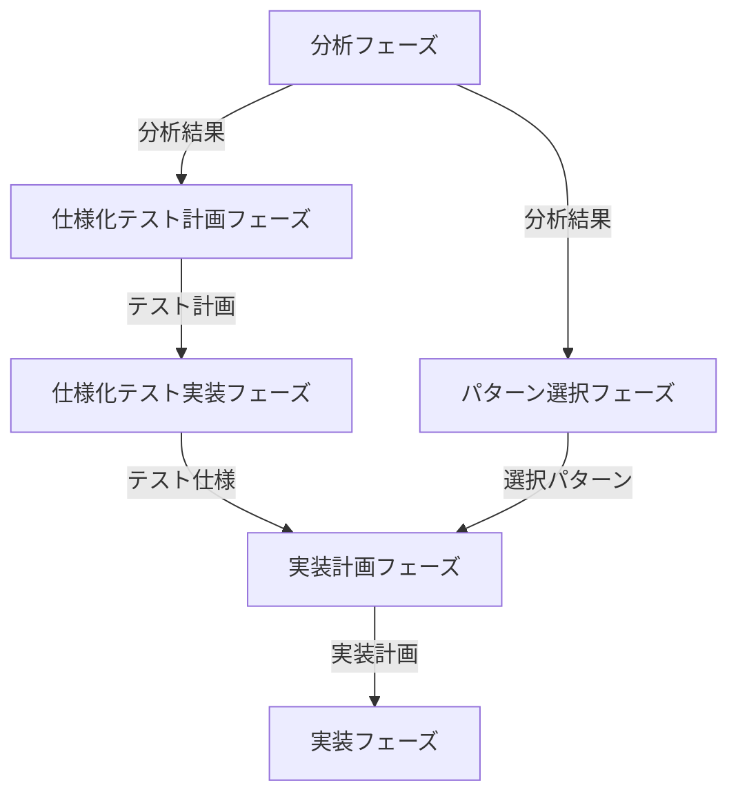

# 依存性注入メインワークフロー

## フェーズ間の連携

### ワークフローの概要

### フェーズ間のチェックポイント

各フェーズの出力が次のフェーズの入力として適切か、以下の基準で確認します：

**分析 → 仕様化テスト計画/パターン選択**
- コードの依存関係が完全に分析されているか
- 結合度・凝集度などのメトリクスが正確に計測されているか
- レイヤー違反が正しく検出されているか
- テスト困難な箇所が特定されているか

**仕様化テスト計画 → 仕様化テスト実装**
- テスト対象の優先順位が適切か
- モック戦略が明確か
- テストスコープが明確か
- リソース配分が現実的か

**仕様化テスト実装 → 実装計画**
- 現在の振る舞いが十分にテストでカバーされているか
- テストケースが具体的な仕様として機能しているか
- モック化が必要な依存関係が明確になっているか

**パターン選択 → 実装計画**
- 選択されたパターンが分析結果と整合しているか
- パターン間の依存関係や競合が考慮されているか
- レイヤーアーキテクチャの制約に違反していないか

**実装計画 → 実装**
- 実装手順が具体的に定義されているか
- 仕様化テストとの整合性が確保されているか
- 影響範囲が適切に評価されているか

## 1. 分析フェーズ

コードベースの分析を実施し、依存性注入の必要性と適用可能性を評価します。
特にテスト困難な箇所や強結合な部分を重点的に分析します。

→ 詳細は `WORKFLOW_ANALYZE_DI.md` を参照し実行してください。

## 2. 仕様化テスト計画フェーズ

既存コードの振る舞いを仕様化テストとして記録し、リファクタリングの安全性を確保します。
テスト困難な箇所は、その原因となる依存関係を特定します。

→ 詳細は `WORKFLOW_SPEC_TEST_PLAN_DI.md` を参照し実行してください。

## 3. 仕様化テスト実装フェーズ

仕様化テスト計画に基づき、仕様化テストを実装します。
テストの保護下で安全に依存性注入を行うための具体的な手順を定義します。

→ 詳細は `WORKFLOW_SPEC_TEST_IMPLEMENT_DI.md` を参照し実行してください。

## 4. パターン選択フェーズ

分析結果に基づき、適切な依存性注入パターンを選択します。
仕様化テスト計画フェーズで発見された課題も考慮に入れます。

→ 詳細は `WORKFLOW_EVALUATE_DI.md` を参照し実行してください。

## 5. 実装計画フェーズ

仕様化テスト実装に基づき、実装計画を立案します。
テストの保護下で安全に依存性注入を行うための具体的な手順を定義します。

→ 詳細は `WORKFLOW_IMPLEMENT_DI.md` を参照し実行してください。

## 6. 実装フェーズ

実装計画に基づき、仕様化テストをガードとして使用しながら、
実際のコード変更を実施します。

→ 詳細は `WORKFLOW_CODE_IMPLEMENT_DI.md` を参照し実行してください。 